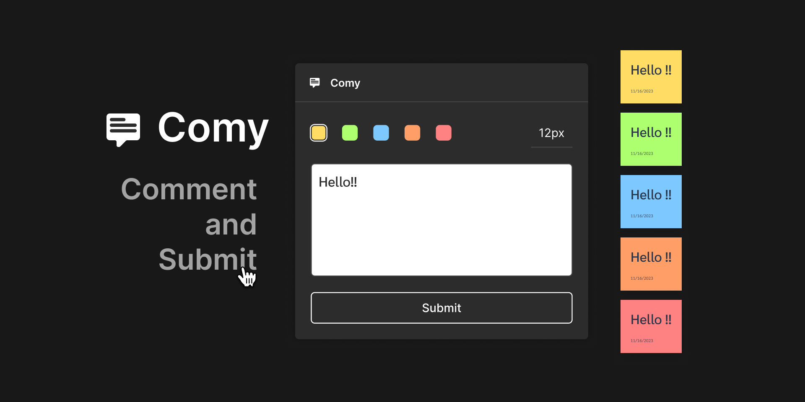

Comy is the plugin allows you to easily create comments within your Figma files.

Simply add a comment of your choice and click Submit, and the comment will be placed next to the frame you want to comment on.

[View Plugin](https://www.figma.com/community/plugin/1240209186379125613/comy).

